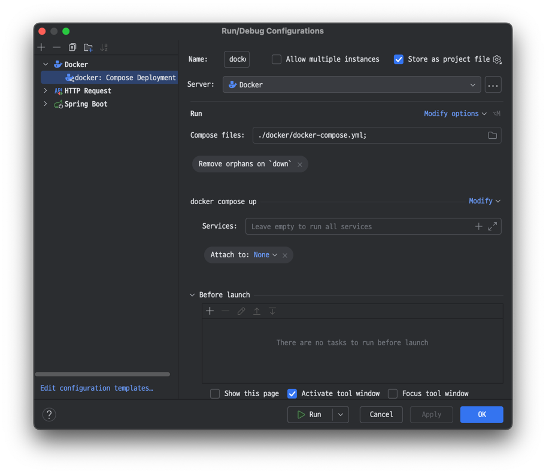
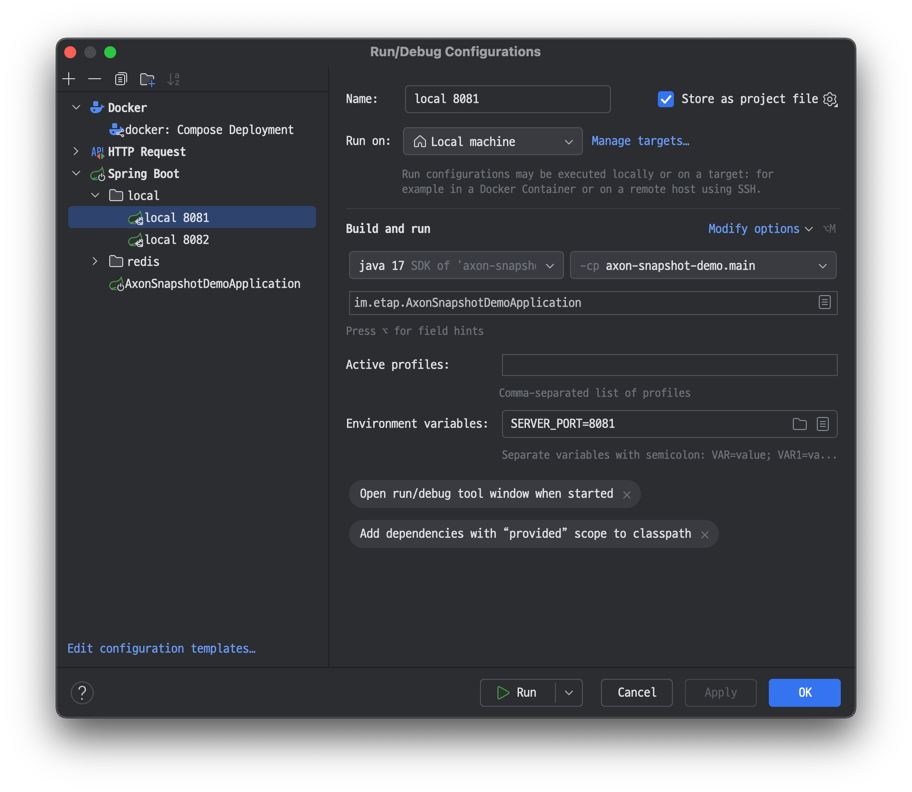
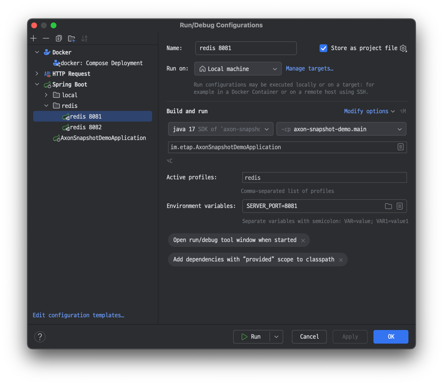

# 개요
이 레포지토리는 Axon Framework를 사용해서 스냅샷 및 분산 캐시를 어그리거트 저장소로 사용하는 방법을 구현한 예제입니다.

# 프로젝트 정보
- **JDK**: 17
- **Spring Boot**: 3.4.4

# 컨테이너 구성
| 구성 요소     | 설명 |
|---------------|------|
| **NGINX**     | 분산 환경을 모의하기 위해 2개의 애플리케이션 인스턴스를 실행하며, 요청을 분산시키는 로드 밸런서 역할을 합니다. |
| **Redis (KeyDB)** | Axon Aggregate의 스냅샷 캐시 저장소로 사용됩니다. |
| **MariaDB**   | Axon의 이벤트 및 스냅샷 저장소로 사용됩니다. |

## Run Configuration
예제의 빠른 실행을 위한 Run Configuration을 제공합니다.
### 1. run docker-compose


```bash
docker-compose -f docker-compose.yml -p axon-snapshot-demo up -d
```

### 2. run application (local)
local 캐시를 사용하는 프로파일입니다. 각각 8081, 8082 포트를 사용합니다.


### 3. run application (redis)
redis 캐시를 사용하는 프로파일입니다. 각각 8081, 8082 포트를 사용합니다.


## http 요청
어플리케이션 실행 시 id가 0인 FooAggregate가 생성됩니다. FooAggregate는 0부터 시작하여 1씩 증가하는 increase 메소드를 가지고 있습니다.
```http
POST http://localhost:8080/foo/0/increase
```
